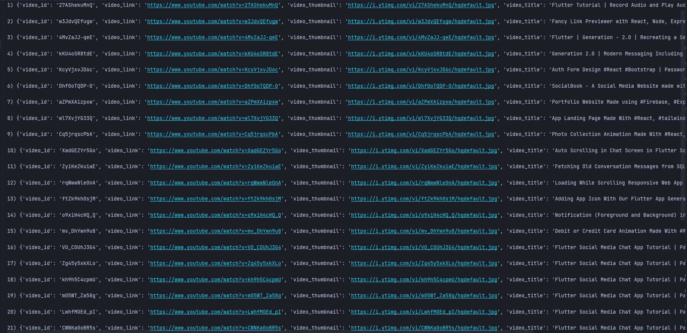

### Get particular youtube channel videos general data

## Alert: You have to place chromedriver in this folder before run the project

#### Step 1 : make sure you have chrome installed on your machine

#### Step 2 : Check your chrome version ( go to three dot then help then about google chrome )

#### Step 3 : Download the same chrome driver from here https://chromedriver.storage.googleapis.com/index.html

#### Step 4 : put it inside the same folder of this code
